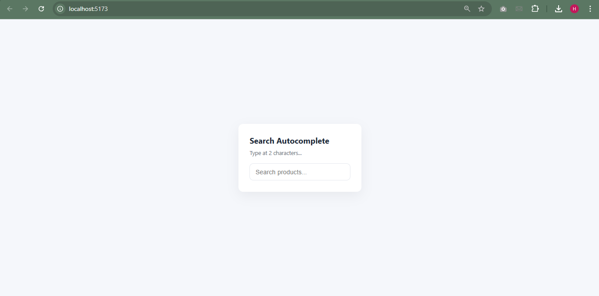

# Search Autocomplete

A modern, responsive React component that provides an autocomplete search functionality for products. This component integrates with the DummyJSON API to fetch and display real-time search suggestions as users type.

## Features

- **Real-time Autocomplete**: Fetches product suggestions dynamically as the user types (minimum 2 characters required).
- **Loading Indicator**: Displays a "Searching..." message during API calls.
- **Clear Functionality**: Includes a clear button to reset the search query and suggestions.
- **Suggestion Selection**: Users can click on suggestions to auto-fill the search box.
- **Responsive Design**: Styled with CSS for a clean, modern look across devices.
- **Error Handling**: Gracefully handles API errors by clearing suggestions.

## Screenshots

### Initial State


### With Suggestions


## Installation

1. Clone the repository:
   ```bash
   git clone <repository-url>
   cd frontend
   ```

2. Install dependencies:
   ```bash
   npm install
   ```

3. Start the development server:
   ```bash
   npm run dev
   ```

4. Open your browser and navigate to `http://localhost:5173` (or the port shown in the terminal).

## Usage

### As a Component

Import the `SearchBox` component into your React application:

```jsx
import SearchBox from './components/SearchBox';

function App() {
  return (
    <div className="app-root">
      <div className="card">
        <h1>Product Search</h1>
        <SearchBox />
      </div>
    </div>
  );
}

export default App;
```

### API Integration

The component uses the [DummyJSON Products API](https://dummyjson.com/docs/products) for search functionality. It makes GET requests to:
```
https://dummyjson.com/products/search?q={query}
```

- **Query Parameter**: The search term entered by the user.
- **Response**: JSON object containing an array of products with `id`, `title`, `brand`, and `price`.

## Project Structure

```
frontend/
├── public/
│   └── vite.svg
├── screenshot/
│   ├── s1.png
│   └── s2.png
├── src/
│   ├── assets/
│   │   └── react.svg
│   ├── components/
│   │   ├── SearchBox.jsx
│   │   └── SearchBox.css
│   ├── App.jsx
│   ├── App.css
│   ├── index.css
│   └── main.jsx
├── .gitignore
├── eslint.config.js
├── index.html
├── package.json
├── README.md
└── vite.config.js
```

## Technologies Used

- **React**: ^19.2.0 - UI library for building the component.
- **Vite**: ^7.2.4 - Build tool and development server.
- **ESLint**: ^9.39.1 - Linting for code quality.
- **DummyJSON API**: External API for product data.

## Scripts

- `npm run dev`: Starts the development server.
- `npm run build`: Builds the project for production.
- `npm run lint`: Runs ESLint to check code quality.
- `npm run preview`: Previews the built application.

## Contributing

Contributions are welcome! Please follow these steps:

1. Fork the repository.
2. Create a new branch for your feature or bug fix.
3. Make your changes and ensure tests pass.
4. Submit a pull request with a clear description of your changes.

## License

This project is private and not licensed for public use.

## Acknowledgments

- [DummyJSON](https://dummyjson.com/) for providing the product API.
- [Vite](https://vitejs.dev/) for the fast build tool.
- [React](https://reactjs.org/) for the component framework.
